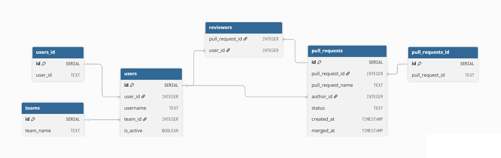

# Тестовое задание на стажировку в Авито (Backend)

Сервис назначения ревьюеров для Pull Request’ов. Написан на языке Go, в качестве базы данных используется PostgreSQL.

## Сборка и запуск

Для автоматизации сборки и запуска сервиса используется [Task](https://taskfile.dev/). Все команды прописаны в Taskfile.yaml

Для сборки и запуска сервиса введите следующую команду:

```bash
task up
```

Сервис будет запущен по адресу localhost:8080

Для просмотра логов сервиса введите следующую команду:

```bash
task logs
```

Остановить сервис можно с помощью команды:

```bash
task down
```

Чтобы провести тесты введите:

```bash
task tests
```

## Решение

### Релизованные эндпоинты

* `/team/add` - Создать команду с участниками (создаёт/обновляет пользователей)
* `/team/get` - Получить команду с участниками
* `/team/deactivate` - Деактивировать всех пользователей команды
* `/team/stats/` - Получить статистику по команде
* `/users/setIsActive` - Установить флаг активности пользователя
* `/users/getReview` - Получить PR'ы, где пользователь назначен ревьювером
* `/pullRequest/create` - Создать PR и автоматически назначить до 2 ревьюверов из команды автора
* `/pullRequest/merge` - Пометить PR как MERGED (идемпотентная операция)
* `/pullRequest/reassign` - Переназначить конкретного ревьювера на другого из его команды

Для хранения данных о пользователях, командах и пул реквестах была использована следующая схема базы данных.



Были прописаны 3 слоя для работы с сервисом: серверный слой (папка `internal/server`), слой сервиса (папка `internal/service`) и слой базы данных (папка `internal/repositories`). В каждом слое прописаны интерфейсы необходимые для его работы, слои опираются лишь на данные интерфейсы а не на конкретные реализации.

Для проверки работоспособности и исправности сервиса были написаны тесты (папка `tests`). Они используют отдельную среду и собираются с помощью отдельного Dockerfile. Так же тесты запускаются при коммите с помощью GitHub Actions.

### Заметки по реализации

* В эндпоинте `/users/getReview` не был прописан случай отсутствия пользователя в системе, так что я добавил его в спецификацию.
* Для хранения отсутствия даты в пул реквесте используется нулевое значение time.Time (00:00:00 1 января 1 года)
* При создании команды с уже существующими пользователями, просто обновляю их данные в базе данных, в том числе ID команды
* Неактивный член команды может быть автором пул реквеста, хоть и не может быть ревьювером
* Кроме работоспособности системы тесты так же проверяют его быстродейственность, так как задан тайм-аут в 300 мс по умолчанию в файле конфигурации

## Используемые инструменты

* [oapi-codegen](https://github.com/oapi-codegen/oapi-codegen) - программа для генерации кода сервера и клиента на основе OpenAPI спецификации. Так же автоматически генерирует код для парсинга запросов и сериализации ответов
* [Gin](https://github.com/gin-gonic/gin) - фреймворк для написания веб-приложений
* [pgx](https://github.com/jackc/pgx) - драйвер для работы с PostgreSQL
* [go-transaction-manager](https://github.com/avito-tech/go-transaction-manager) - менеджер транзакций
* [cleanenv](https://github.com/ilyakaznacheev/cleanenv) - библиотека для чтения файлов конфигурации
* [migrate](https://github.com/golang-migrate/migrate) - программа и библиотека для управления миграциями БД
* [testify](https://github.com/stretchr/testify) - библиотека для написания тестов
* [gofakeit](https://github.com/brianvoe/gofakeit) - библиотека для генерации случайной информации, как в форме чисел, так и в форме текста (случайные ID, слова, предложения)
